# PyGenKit

[](https://github.com/alan-n7x/pygenkit/actions/workflows/ci.yml)
[](https://www.python.org/)
[](LICENSE)
[](https://docs.astral.sh/ruff/)
[](https://mypy-lang.org/)

Professional Python project generator -- **PyPI**, **APT**, and **Launchpad** ready.

PyGenKit helps you bootstrap, inspect, validate, and release Python projects with a production-oriented workflow. It can analyze an existing codebase, check version consistency and CI/CD security, and generate GitHub Actions pipelines, Dockerfiles, and deploy configuration files.

<p align="center">
  
</p>

## Why PyGenKit?

Modern Python projects often need more than just source code: packaging metadata, CI, linting, type checking, tests, release automation, Docker, and deployment files. PyGenKit brings those pieces together in a repeatable CLI workflow so new projects start with a professional foundation.

## Features

- Scaffold Python projects with a `src/` layout and CI/CD-ready defaults
- Inspect existing projects for metadata, packaging, versioning, and workflow state
- Validate version consistency across project files, git tags, and Debian packaging files
- Detect risky CI/CD patterns, outdated actions, missing permissions, and potential secrets
- Generate GitHub Actions workflows for CI, releases, PyPI, and Launchpad publishing
- Generate Docker and deployment configuration for common platforms
- Check local development requirements with a `doctor` command

## Installation

```bash
pip install pygenkit
```

Or via `uv`:

```bash
uv tool install pygenkit
```

## Quick Start

```bash
# Scaffold a complete project with CI/CD
pygenkit new my-app
cd my-app

# Inspect project structure
pygenkit inspect

# Validate versions, workflows, and security
pygenkit validate

# Generate CI/CD pipelines, Docker, and deploy configs
pygenkit generate

# Check system requirements
pygenkit doctor
```

## Example Output

```text
Project: my-app
Version: 0.1.0
Python: >=3.12
Build backend: setuptools
License: MIT
CI/CD: GitHub Actions detected
Status: ready for validation
```

## Commands

| Command         | Description                                    |
|-----------------|------------------------------------------------|
| `new`           | Scaffold a complete Python project with CI/CD  |
| `init`          | Create `pygenkit.toml` in an existing project  |
| `inspect`       | Analyze project structure, versions, metadata  |
| `validate`      | Check version consistency, workflows, security |
| `generate`      | Generate CI/CD, Docker, and deploy files       |
| `health`        | Assess project health across 7 categories      |
| `review`        | Review a GitHub PR diff using AI               |
| `release-check` | Verify release readiness before tagging        |
| `doctor`        | Check system for required tools                |

## Usage

```bash
# Create config
pygenkit init my-project

# Inspect project
pygenkit inspect

# Validate project metadata, workflows, and security
pygenkit validate

# Generate GitHub Actions CI/CD pipelines
pygenkit generate

# Dry-run to preview without writing
pygenkit generate --dry-run

# Overwrite existing files
pygenkit generate --force

# Enable Docker + deploy in config, then generate:
#   [docker]
#   enabled = true
#   base_image = "3.12"
#   port = 8000
#
#   [deploy]
#   enabled = true
#   fly = true
#   heroku = true
#   railway = true
```

## Inspect

Scans your project and reports:

- Project name, version, module
- Build backend: setuptools, hatchling, poetry, etc.
- Python version requirement
- License type: MIT, Apache, GPL, etc.
- Version consistency between `pyproject.toml`, `__init__.py`, `debian/changelog`, and git tags
- CI/CD workflow detection
- Debian packaging status

## Validate

Runs three categories of checks:

- **Version**: consistency across `pyproject.toml`, `__init__.py`, `debian/changelog`, and git tags
- **Workflow**: YAML validity, missing metadata, outdated actions, SHA pin warnings, and script injection risks
- **Security**: missing permissions blocks, hardcoded secrets, and PyPI publishing without a protected environment

## Generate

Generates files from Jinja2 templates based on `pygenkit.toml`.

### GitHub Actions

| File                                      | Description                          |
|-------------------------------------------|--------------------------------------|
| `.github/workflows/ci.yml`                | Ruff lint, MyPy type-check, Pytest   |
| `.github/workflows/release.yml`           | Build wheel and create GitHub Release |
| `.github/workflows/publish-pypi.yml`      | Trusted PyPI publishing              |
| `.github/workflows/publish-launchpad.yml` | dput to Launchpad PPA                |

### Docker

| File                 | Description           |
|----------------------|-----------------------|
| `Dockerfile`         | Multi-stage build     |
| `docker-compose.yml` | Service configuration |

### Deploy

| File           | Platform |
|----------------|----------|
| `fly.toml`     | Fly.io   |
| `Procfile`     | Heroku   |
| `railway.json` | Railway  |

## Configuration (`pygenkit.toml`)

```toml
[project]
name = "my-app"
version = "0.1.0"
extras = ""

[ci]
python_versions = ["3.12", "3.13"]
runner = "ubuntu-latest"
lint = true
type_check = true

[release]
branch = "main"
tag_prefix = "v"
changelog = "CHANGELOG.md"

[pypi]
enabled = true
environment = "pypi"
trusted_publishing = true

[debian]
enabled = true
email = ""
name = ""
owner = ""
ppa = "tools"
distributions = ["noble"]
revision = "1"

[github]
ci = true
release = true
publish_pypi = true
publish_launchpad = true

[docker]
enabled = false
base_image = "3.12"
port = 8000
volumes = []

[deploy]
enabled = false
fly = true
heroku = true
railway = true
primary_region = "iad"
port = 8000
memory = "512mb"
cpu_kind = "shared"
cpus = 1
```

## Doctor

```bash
pygenkit doctor
```

Checks for:

- Python 3.12+
- Git
- GitHub CLI (`gh`)
- GPG
- dput
- debhelper
- twine
- build

## Publishing setup

PyPI publishing uses Trusted Publishing (OIDC), so it does not require a long-lived API token. Configure the `pypi` environment on GitHub and authorize `release.yml` as a Trusted Publisher for the `pygenkit` project on PyPI. Set the repository variable `PYPI_ENABLED=true` to enable the publish step.

Launchpad publishing requires a PPA and an OpenPGP key registered with the Launchpad account. Add these secrets to the `launchpad` GitHub environment:

- `GPG_PRIVATE_KEY`
- `GPG_PASSPHRASE`
- `GPG_KEY_ID`

## Architecture

```text
src/pygenkit/
├── cli/              # CLI commands (Typer)
│   └── commands/     # init, inspect, validate, generate, release-check, doctor
├── generators/       # GitHub Actions, Docker, Deploy generators
│   ├── base.py       # Base generator with RenderEngine
│   ├── github_actions.py
│   ├── docker.py
│   ├── deploy.py
│   └── orchestrator.py
├── inspector/        # Read and analyze existing projects
│   ├── api.py        # Main inspect_project()
│   ├── debian.py     # Debian packaging inspection
│   ├── detect.py     # Module, tests, license, version detection
│   ├── git.py        # Git remote, tags
│   └── pyproject.py  # pyproject.toml parsing
├── models/           # Data models (dataclasses)
│   ├── config.py     # PyGenKitConfig and sub-configs
│   └── inspection.py # ProjectInspection and sub-inspections
├── render/           # Jinja2 rendering engine
├── templates/        # Jinja2 templates for generation
│   ├── github/workflows/   # CI, release, PyPI, Launchpad workflows
│   ├── docker/             # Dockerfile, docker-compose
│   └── deploy/             # Fly.io, Heroku, Railway configs
├── utils/            # File utilities, template filters
└── validators/       # Version, workflow, security validators
    ├── api.py
    ├── version.py
    ├── workflow.py
    └── security.py
```

## Development Workflow

PyGenKit itself follows the professional workflow it generates for other projects.

```text
feature branch → Pull Request → CI checks → merge to main → tag → release
```

### Step by step

```bash
# 1. Create a feature branch
git checkout -b feat/my-feature

# 2. Code, commit, push
ruff check src/ tests/
mypy src/pygenkit/
pytest
git add . && git commit -m "feat: description"
git push -u origin feat/my-feature

# 3. Open a Pull Request on GitHub
#    CI runs automatically on PR

# 4. After merge, tag a release
git checkout main
git pull
pygenkit release-check    # verify readiness
git tag v0.x.x
git push origin v0.x.x     # triggers Release workflow
```

### Branch naming

| Prefix       | Purpose            |
|--------------|--------------------|
| `feat/*`     | New features       |
| `fix/*`      | Bug fixes          |
| `refactor/*` | Code improvements  |
| `docs/*`     | Documentation      |
| `ci/*`       | CI/CD changes      |

## Branch Protection

The `main` branch should be protected in the GitHub repository settings.

### Required settings

| Setting                             | Solo | Team |
|-------------------------------------|------|------|
| Require pull request before merging | Yes  | Yes  |
| Require status checks to pass       | Yes  | Yes  |
| Block force pushes                  | Yes  | Yes  |
| Restrict deletions                  | Yes  | Yes  |
| Required approvals                  | 0    | 1    |

When working alone, skip approval requirements. When adding maintainers, set **Required approvals: 1**.

### How to configure

```text
GitHub repo → Settings → Branches → Add branch protection rule
  Branch name pattern: main
  ☑ Require a pull request before merging
  ☑ Require status checks to pass
  ☑ Require CI
  ☑ Block force pushes
  ☑ Restrict deletions
```

## Roadmap

- Add richer CLI examples and screenshots
- Add code coverage reporting
- Add project templates for FastAPI, CLI tools, and libraries
- Add semantic versioning helpers
- Add optional plugin support for custom generators
- Expand release checks for PyPI, Debian, and Launchpad workflows

## Requirements

- Python 3.12+

## License

GNU General Public License v3.0 only (`GPL-3.0-only`). See [LICENSE](LICENSE).
